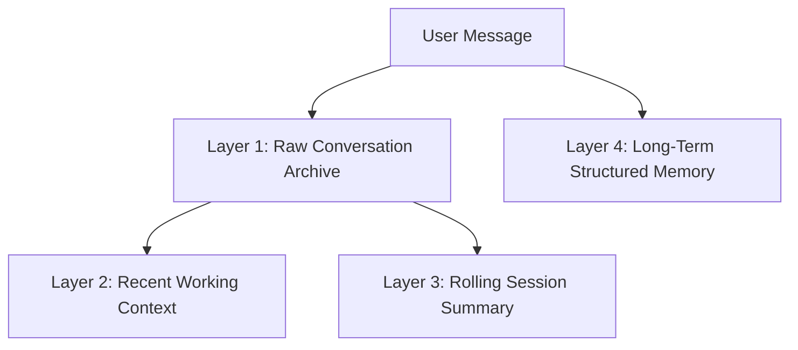

# Memory Architecture

This document describes the design and implementation of the multi-tiered persistent memory system for the 3D AI Companion.

---

## 1. Memory Layers

To provide human-like memory characteristics, the system is structured into four distinct layers:



### Layer 1: Raw Conversation Archive
- **Purpose**: A complete record of all user and assistant messages.
- **Storage**: `chat_messages` table in Supabase.
- **Retention**: Configured via `MEMORY_RETENTION_DAYS`. Default is `0` (store indefinitely).
- **Function**: Serves as the source of truth for loading chat history and generating summaries.

### Layer 2: Recent Working Context
- **Purpose**: Keep the immediate conversation flow in the model's active context.
- **Limit**: Last `MEMORY_RECENT_MESSAGE_LIMIT` (default 24) messages.
- **Trimming**: Dynamically limited to fit within the model's token budget.

### Layer 3: Rolling Session Summary
- **Purpose**: Compress historical context of the current session to save token space.
- **Trigger**: Automatically generated when 20+ new messages are accumulated in the session.
- **Format**: Text summary capturing main topics, decisions, user preferences/goals, and unresolved questions.

### Layer 4: Long-Term Structured Memory
- **Purpose**: Remember stable facts, user identity properties, basic preferences, and instructions across multiple distinct sessions.
- **Storage**: `conversation_memories` table in Supabase.
- **Categorization**:
  - *Shared*: Identity and core preferences (e.g. name, language) are shared across companions (`character_id` is null).
  - *Character-Specific*: Relationship facts and character instructions are specific to the active companion (`character_id` is set).

---

## 2. Database Schema

The database migration `002_persistent_memory.sql` introduces the following tables and extensions:

### `conversation_memories`
- Stores structured key-value memories with metadata.
- **Keys**: `id`, `anonymous_id`, `character_id`, `kind` (identity/preference/goal/project/relationship/instruction), `content` (third-person fact), `normalized_key` (camelCase key, e.g. `userName`), `importance`, `confidence`, `explicit_user_request`, `sensitive`, `status` (active/superseded/deleted), `source_session_id`, `source_message_ids`, `supersedes_memory_id`, `first_seen_at`, `last_seen_at`, `fts_doc` (tsvector index).

### `conversation_summaries`
- Archives history records of rolling summaries.
- **Keys**: `id`, `session_id`, `from_message_id`, `through_message_id`, `message_count`, `summary`, `topics`, `unresolved_items`.

### `memory_audit_log`
- Tracks all memory modifications, creations, and deletions.
- **Keys**: `id`, `memory_id`, `event_type`, `previous_content`, `new_content`, `metadata`.

---

## 3. Session Lifecycle & Controls

### Active Session Recovery
- On page load, the frontend checks for an active session ID in `localStorage`.
- If found, it fetches the recent history via `GET /api/conversations` and populates the UI.
- If none is active, it loads the most recent session from the user's session list.

### Session Operations
- **New Chat**: Generates a new session ID and clears the active chat window, keeping long-term memories active.
- **Rename Session**: Renames the conversation title in the sidebar.
- **Delete Session**: Cascade deletes the session and its messages from the database.
- **Export Data**: Downloads a complete JSON containing all sessions, chat logs, and long-term memories.

---

## 4. Extraction & Retrieval

### Memory Extraction (Background)
- Fired asynchronously after returning the AI companion's reply.
- Prompts Mistral to extract memories or forget commands using structured JSON mode.
- **Deduplication**: Checks active keys. If a new memory matches an existing key but contains new info, the old record is set to `superseded` and the new one is inserted. If identical, it bumps `confidence` and `last_seen_at`.

### Retrieval & Ranking
- When formulating a system prompt, the API queries memories using simple full-text search matching keywords in the user's message.
- Bumps relevance with a fallback to general identity and preference cards to ensure the AI always recalls the user's name and core details.
- Context is assembled as:
  ```
  [LONG-TERM MEMORY]
  - Fact 1
  - Fact 2

  [CURRENT SESSION SUMMARY]
  <summary text>

  [PAST SESSIONS SUMMARY]
  - Session title: summary text
  ```

---

## 5. Privacy Rules

- **Sensitive Data**: Passwords, health, private status, and financial details are explicitly filtered out.
- **User Disabling**: Users can toggle memory off. When disabled, the extraction process is skipped, and retrieve returns empty context blocks.

---

## 6. Offline Outbox Sync

- If the backend database goes offline (e.g. Supabase connection failure), the chat does not block.
- Messages are saved client-side in an IndexedDB object store (`outbox`).
- The UI highlights a "Chưa đồng bộ" warning flag on system messages.
- When connection recovers, the client automatically syncs pending writes to `POST /api/conversations/:sessionId/messages` to catch up.

---

## 7. Current Retrieval/Route Timing Notes

Takeover rerun on 2026-07-10 confirmed:

- Chat history and memory context retrieval are started concurrently.
- Memory context queries for current summary, general memories, matched memories, and past summaries are grouped under a `MEMORY_RETRIEVAL_TIMEOUT_MS` fallback.
- `/api/chat` emits `Server-Timing` values for `recent-history`, `memory-wall`, `memory-db-memories`, `memory-db-summary`, `memory-db-past`, `context-build`, `mistral`, and `total`.
- `GET /api/sessions` has a bounded Supabase query timeout and returns controlled `503` JSON on Supabase timeout/error instead of hanging.

After applying `001_chat_schema.sql` and `002_persistent_memory.sql`, live browser memory E2E passed on 2026-07-10. Artifact: `test-results/browser/memory/memory-e2e-after-forget-guard.json`.

Additional takeover fixes:

- `/api/chat` uses per-request memory timing results instead of reading shared `MemoryService` timing state.
- Disabled-memory chat responses include `memory-disabled;dur=0` and zero `memory-db-*` timings.
- Memory retrieval now keeps subquery results that finish before the retrieval deadline instead of discarding all memory context when one subquery is slow.
- Deleted memory keys are included as guardrails so past summaries and assistant text do not resurrect facts the user asked to forget.
- Background extraction is instructed and guarded not to recreate deleted keys from assistant-only statements.

The later formal five-run enabled/disabled benchmark passed the retrieval budget. Enabled memory wall p95 was 497 ms against the 700 ms target, with 0 timeouts and 0 fallbacks; disabled runs reported zero memory wall/subquery/context timing. Artifact: `test-results/browser/memory/memory-benchmark-final.json`. Remote Supabase subquery latency is still variable and should continue to be monitored.
